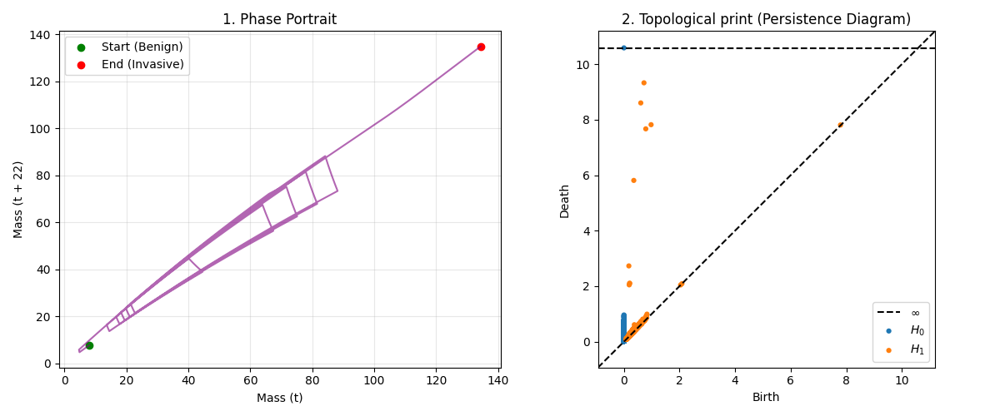
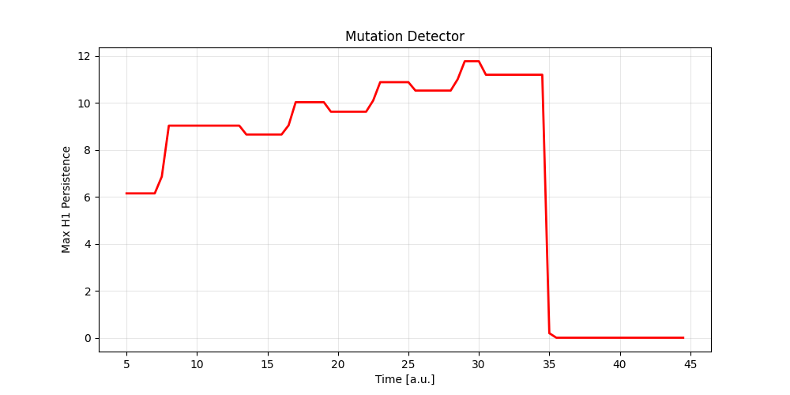

# Topological Detection of Mutation in Adaptive Cancer Therapy (TDA + PDE)
## Overview
This project introduces a computational approach to the early detection of drug resistance (mutation) during **Adaptive Cancer Therapy**. It leverages spatial modeling (PDE) and **Topological Data Analysis (TDA)** to build an automated Early Warning System that monitors the evolutionary stability of the tumor.

##  Biological Background: Adaptive Therapy
Standard oncology often relies on the Maximum Tolerated Dose (MTD) approach, which frequently leads to the rapid selection of chemoresistant cells. Adaptive therapy, pioneered by the Moffitt Cancer Center, uses a different evolutionary strategy: **cyclical drug administration (ON/OFF)**. 
By maintaining a population of drug-sensitive cells, the therapy exploits cellular competition to suppress the resistant phenotype, effectively turning cancer into a manageable chronic disease.
* **The Challenge:** How can we automatically detect the exact moment the tumor inevitably mutates, breaks the evolutionary cycle, and escapes therapeutic control?

* ## Mathematical Model (PDE to Time Series)
The foundation of the simulation is a nonlinear Partial Differential Equation (PDE) modeling the spatial growth, diffusion, and localized drug-induced death of the tumor tissue (see `phase of adaptive t.py`).
To apply time-series topology, the spatial dimension is reduced by integrating the tumor density at each time step. This yields a 1D time series of the total tumor mass, which acts as a proxy for clinical biomarkers (e.g., PSA levels in blood).

## Topological Data Analysis & Takens' Theorem
Instead of analyzing the raw, often noisy trend of the tumor mass, this project examines the **topological structure of the system's dynamics**. 
Using Takens' Theorem (Delay-Coordinate Embedding) with a time delay $\tau = 22$, the 1D mass signal is embedded into a phase space.

Successful treatment cycles manifest as stable, recurring loops (attractors) in this phase space. To quantify the existence and lifespan of these loops, the model uses **Persistent Homology** (specifically the $H_1$ feature, via the `ripser` library).

## The Detector Engine (Sliding Window)
The core detection algorithm is implemented in `puls_tda.py`. 
It utilizes an overlapping sliding window approach. As the window scans through the embedded time series, it continuously computes persistent homology diagrams and extracts the maximum persistence of 1D loops ($\max H_1$).

## Results: The Early Warning Signal
The resulting output is a clear, actionable signal for clinicians:

While the adaptive therapy successfully controls the tumor, the topological signal ($H_1$ persistence) remains high and stable. At $t=35$, when a mutation is introduced and resistant cells begin to dominate, the phase cycle breaks. The algorithm instantly detects the destruction of the attractor, dropping the signal to zero. This "cliff" serves as an immediate, automated alarm that the evolutionary stability has collapsed.
