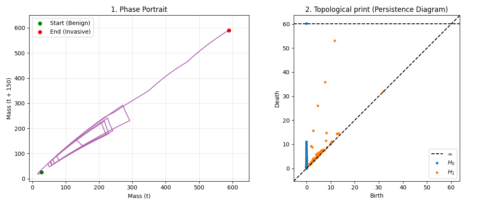
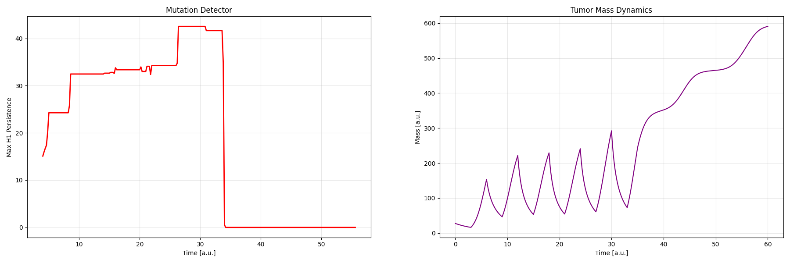

# Topological Detection of Mutation in Adaptive Cancer Therapy (TDA + PDE)

## Overview
This project introduces a computational approach to the early detection of drug resistance (mutation) during Adaptive Cancer Therapy. It leverages spatial modeling of acid-mediated tumor invasion (PDEs) and Topological Data Analysis (TDA) to build an automated Early Warning System that monitors the evolutionary stability of the tumor.

## Biological Background: Adaptive Therapy
Standard oncology often relies on the Maximum Tolerated Dose (MTD) approach, which frequently leads to the rapid selection of chemoresistant cells. Adaptive therapy uses a different evolutionary strategy: cyclical drug administration (ON/OFF).
By maintaining a population of drug-sensitive cells, the therapy exploits cellular competition to suppress the resistant phenotype, effectively turning cancer into a manageable chronic disease.

Simultaneously, the tumor alters its microenvironment through the Warburg effect, producing excess acid (H+) that destroys surrounding healthy tissue and facilitates invasion.
* **The Challenge:** How can we automatically detect the exact moment the tumor inevitably mutates, breaks the evolutionary cycle, overcomes the healthy tissue via acid invasion, and escapes therapeutic control?

## Mathematical Model (Gatenby-Gawlinski PDE to Time Series)
The foundation of the simulation is the dimensionless Gatenby-Gawlinski (1996) reaction-diffusion model (implemented in `Gateby_model.py`). The system captures the spatial dynamics of three interacting variables on a 2D grid:
1. Healthy tissue density
2. Tumor cell density
3. Excess acid concentration

The model utilizes Zero-Flux (Neumann) boundary conditions. To apply time-series topology, the spatial dimension is reduced by integrating the 2D tumor density at each time step. This yields a 1D time series of the total tumor mass, which acts as a proxy for clinical biomarkers (e.g., PSA levels in blood).

## Topological Data Analysis & Takens' Theorem
Instead of analyzing the raw, often noisy trend of the tumor mass, this project examines the topological structure of the system's spatial dynamics. Using Takens' Theorem (Delay-Coordinate Embedding) with an empirically optimized time delay $\tau = 150$ to fully unfold the attractor, the 1D mass signal is embedded into a phase space.

Successful treatment cycles manifest as stable, recurring loops (attractors) in this phase space. To quantify the existence and lifespan of these loops, the model uses **Persistent Homology** (specifically the $H_1$ feature, via the `ripser` library).

## The Detector Engine (Sliding Window)
The core detection algorithm utilizes an overlapping sliding window approach. As the window scans through the embedded time series, it continuously computes persistent homology diagrams and extracts the maximum persistence of 1D loops ($\max H_1$).

## Results: The Early Warning Signal
The resulting output provides a clear, actionable signal for clinicians, demonstrating a significant advantage over standard tumor mass monitoring. While the adaptive therapy successfully controls the tumor, the topological signal ($H_1$ persistence, red) remains high and forms distinct "steps," reflecting stable, spatially expanding treatment cycles.

At $t=35$, when a mutation is introduced, the raw tumor mass (purple) begins to grow. However, this early volume increase is deceptive and could easily be mistaken for a normal cycle peak. In contrast, the topological algorithm instantly detects the destruction of the underlying phase space attractor. The $H_1$ signal definitively drops to zero, serving as an immediate, automated alarm that evolutionary stability has collapsed-detecting the mutation much earlier and more reliably than observing the raw tumor mass alone.
